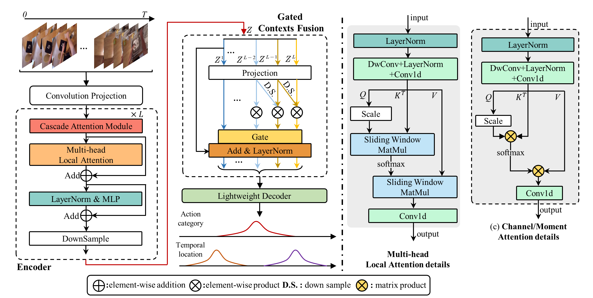

[TMM 2023] TransGMC: Gated Multi-Scale Transformer for Temporal Action Localization

# TransGMC: Gated Multi-Scale Transformer for Temporal Action Localization


### Introduction
This code repo implements TransGMC in _TMM 2023_. TransGMC achieves an average mAP of 67.5% on THUMOS14, 36.1% on ActivityNet v1.3, 24.9% on EPIC-Kitchens 100, and 23.2% on Ego4D.


### Environment
<div align="center">

|  Name  | Version              |
| :----: | ---------------------|
| Python | 3.10.9               |
| Torch  | 1.11.0               |
|  Cuda  | 11.3                 |
| Nvidia | NVIDIA GeForce RTX 3090 |

</div>

### Data Preparation/Installation/More Details
Please refer to [ActionFormer](https://github.com/happyharrycn/actionformer_release) for more details.
### Training and Evaluation
- Train(Take `epic_slowfast_verb` as an example)
```python 
python ./train.py --config ./configs/epic_slowfast_verb.yaml --output model
```
- Evaluation (Take `epic_slowfast_verb` as an example)
```python
python ./eval.py ./configs/epic_slowfast_verb.yaml ./ckpt/epic_slowfast_verb_model/
```
### Model

<div align="center">

|  Dataset  | Model              |
| :----: | ---------------------|
| Epic Kitchens (verb) |    [google drive download link](https://drive.google.com/drive/folders/1Ptu5IqlEQjtpbcdfCbFfXbf3ETSm3AJz?usp=drive_link)            |
| Epic Kitchens (noun)  |     [google drive download link](https://drive.google.com/drive/folders/1wg1wcRJxXuD2IRVNI_MeMGYg8dp7BFS_?usp=drive_link)           |
| Ego4D(S+O+E) | [google drive download link](https://drive.google.com/drive/folders/1Tdm9qAURTrAXtZIKzlXzRO7AhyA3uO7I?usp=drive_link) |
|  Thumos14  |      [google drive download link](https://drive.google.com/drive/folders/1vsuF_309DJQNBELIjmYYehZwJSffZgXB?usp=drive_link)            |
| ActivityNet v1.3 (I3D) | [google drive download link](https://drive.google.com/drive/folders/1qS-8LYoT6NRw-KJUD6HN57m_7XcUeJpv?usp=drive_link)  |

</div>

### References
If you are using our code, please consider citing the following paper.
```
@article{yang2023gated,
  title={Gated Multi-Scale Transformer for Temporal Action Localization},
  author={Yang, Jin and Wei, Ping and Ren, Ziyang and Zheng, Nanning},
  journal={IEEE Transactions on Multimedia},
  year={2023},
  publisher={IEEE}
}
```

```
@inproceedings{zhang2022actionformer,
  title={ActionFormer: Localizing Moments of Actions with Transformers},
  author={Zhang, Chen-Lin and Wu, Jianxin and Li, Yin},
  booktitle={European Conference on Computer Vision},
  series={LNCS},
  volume={13664},
  pages={492-510},
  year={2022}
}
```

#### The implementation of this code is built upon [ActionFormer](https://github.com/happyharrycn/actionformer_release), and we would like to express gratitude for the open-source contribution of [ActionFormer](https://github.com/happyharrycn/actionformer_release).